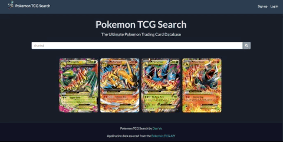
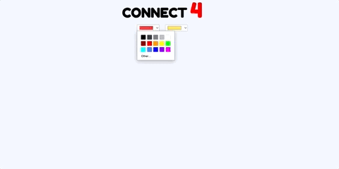
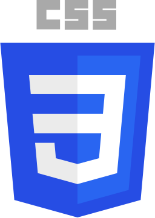

### Hi, I'm Dan 👋

Feel free to check out some cool things I've built!

<!--
**thedvo/thedvo** is a ✨ _special_ ✨ repository because its `README.md` (this file) appears on your GitHub profile.

Here are some ideas to get you started:

- 🔭 I’m currently working on ... 
- 🌱 I’m currently learning ...
- 👯 I’m looking to collaborate on ...
- 🤔 I’m looking for help with ...
- 💬 Ask me about ...
- 📫 How to reach me: ...
- 😄 Pronouns: ...
- ⚡ Fun fact: ...
-->

<h2 align="center" color="white">Projects</h2>
    

        <table>
            <tr>
                <td valign="top" width="50%">
                    <h3 align="center" color="white">Instagram Clone</h3>
                    

                        
                         
                         
                        

                            
                            
                        

                        
<strong>Node.js, Express, React, PostgreSQL </strong> - Full-stack clone mimicking early version of Instagram. Photos only. 

                    

                </td>
                <td valign="top" width="50%">
                    <h3 align="center" color="white">Pokemon Trading Card Search</h3>
                    

                        
                         
                         
                        

                            
                            
                        

                        
<strong>Python, HTML, CSS, Bootstrap </strong> - App for users to search through a well documented archive of Pokemon trading cards. 

                    

                </td>  
            </tr>
            <tr>
            <td valign="top" width="50%">
                    <h3 align="center" color="white">Connect 4</h3>
                    

                        
                         
                         
                        

                            
                            
                        

                        
<strong>JavaScript, CSS, HTML</strong> - Two-Player Connect 4 game. Allows users to pick any color. 

                    

                </td>
            </tr>
        </table>
    

     

<h2 align="center" color="white">Technologies</h2>
    

        <table>
            <tr>
                <td valign="top" width="33.3333%">
                    <h3 align="center" color="white">Frontend</h2>
                     
                    

                        
                        &nbsp&nbsp&nbsp
                        
                        &nbsp&nbsp&nbsp
                        
                         
                         
                        &nbsp&nbsp&nbsp
                        
                        &nbsp&nbsp&nbsp
                        
                        &nbsp&nbsp&nbsp
                        
                        &nbsp&nbsp&nbsp
                        
                    

                </td>
                <td valign="top" width="33.3333%">
                    <h3 align="center" color="white">Backend</h3>
                     
                    

                        &nbsp
                        
                        &nbsp&nbsp&nbsp
                        
                        &nbsp&nbsp&nbsp
                        
                         
                         
                        &nbsp&nbsp&nbsp
                        
                        &nbsp&nbsp&nbsp
                        
                         
                         
                    

                </td>
                <td valign="top" width="33.3333%">
                    <h3 align="center" color="white">Other</h3>
                     
                    

                        &nbsp
                        
                        &nbsp&nbsp
                        
                        &nbsp&nbsp
                        
                        &nbsp
                        
                        &nbsp
                        
                        &nbsp
                        
                        &nbsp
                        
                        &nbsp
                        
                    

                </td>
            </tr>
        </table>
    

	

 
